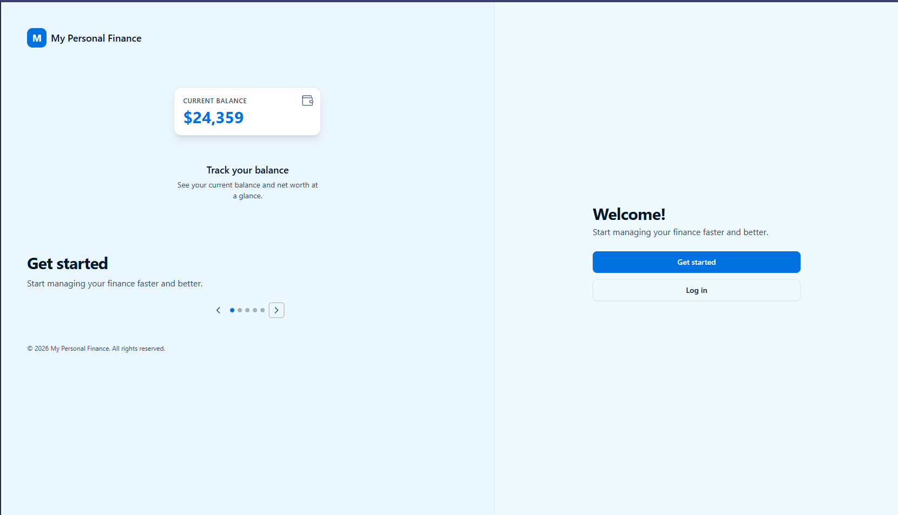
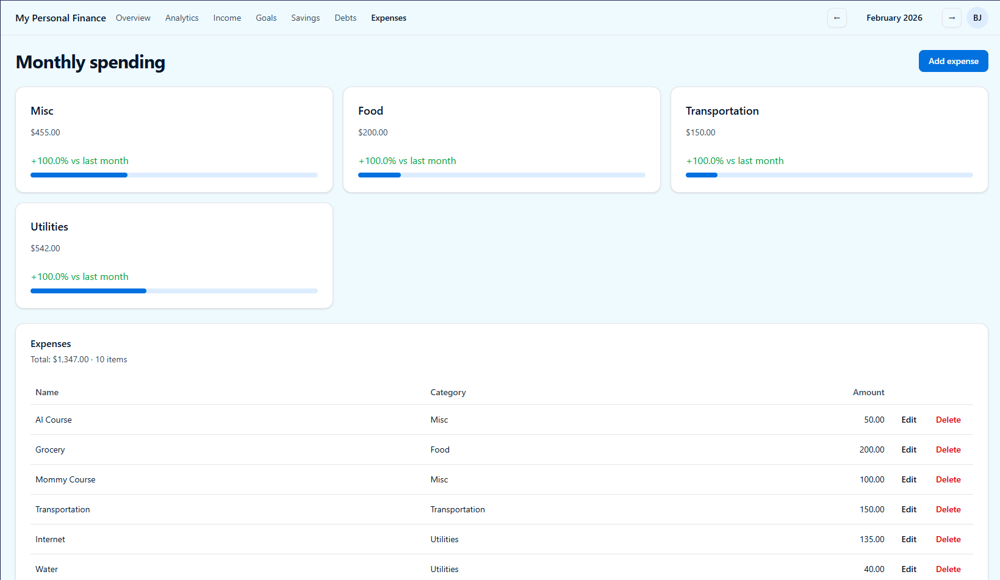
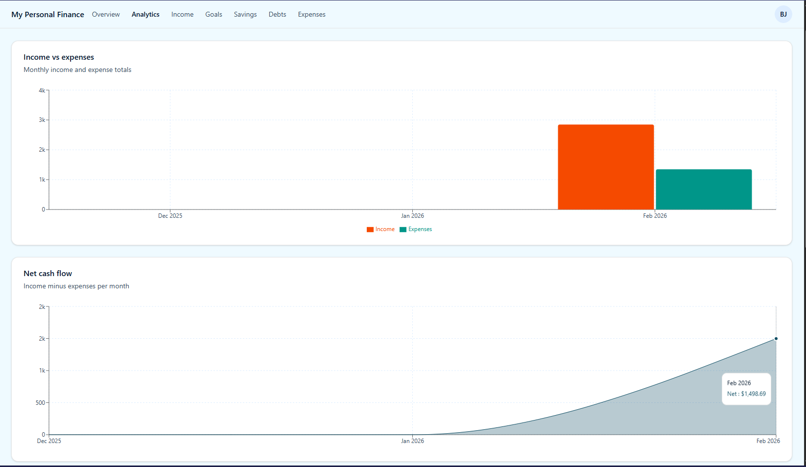
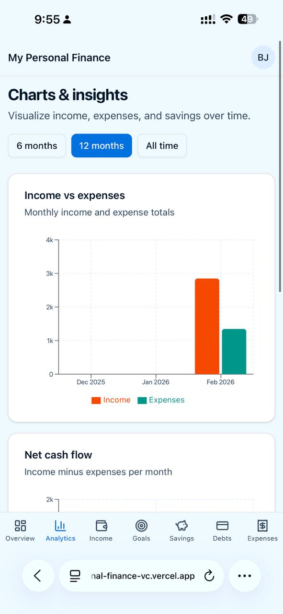
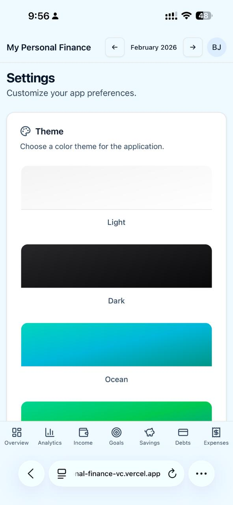

# My Personal Finance

A single place to manage your money—income, expenses, savings, goals, and debts—with a clear overview and charts so you can see where you stand.

I built this because I wanted **one platform** where I could actually manage my finance the way I want. Compared to other apps, this is the experience I was looking for.

---

## What you get

### Welcome & balance at a glance

Land in one place: see your current balance and net worth, and get started or log in without clutter.

---

### Overview

Dashboard with your totals: **total income**, **total expenses**, **net savings**, and **active goals** in one view. Pick a month and see the numbers that matter.

---

### Expenses

Track spending by category (Food, Transportation, Utilities, Misc, etc.). See **monthly spending** per category with a comparison to last month, add and edit or delete individual expenses, and browse a full list of transactions for the selected month.

---

### Analytics & charts

**Income vs expenses** as monthly bars so you can compare earnings and spending at a glance. **Net cash flow** over time (income minus expenses per month) so you see your financial trend. Choose the period (e.g. 6 months, 12 months, all time) and use the same analytics on desktop and mobile.

---

### Income, goals, savings & debts

- **Income** – Record and manage your income (primary and additional sources).
- **Goals** – Set goals and link them to savings accounts to track progress.
- **Savings** – Manage savings accounts and their transactions.
- **Debts** – Track what you owe and pay it down.

All of this is in the main navigation so you can move between Overview, Analytics, Income, Goals, Savings, Debts, and Expenses in one app.

---

### Settings & theme

Customize the app to your preference: choose **Light**, **Dark**, **Ocean**, or other themes so the interface fits how you like to work.

